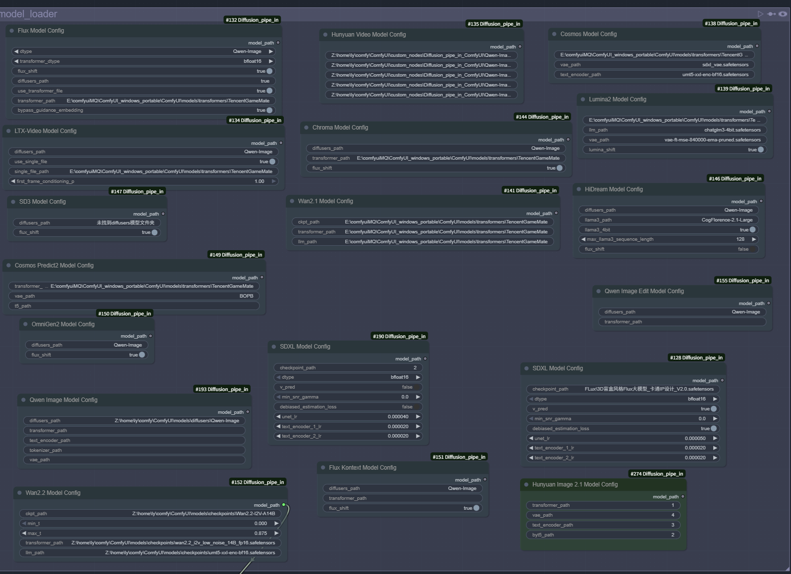
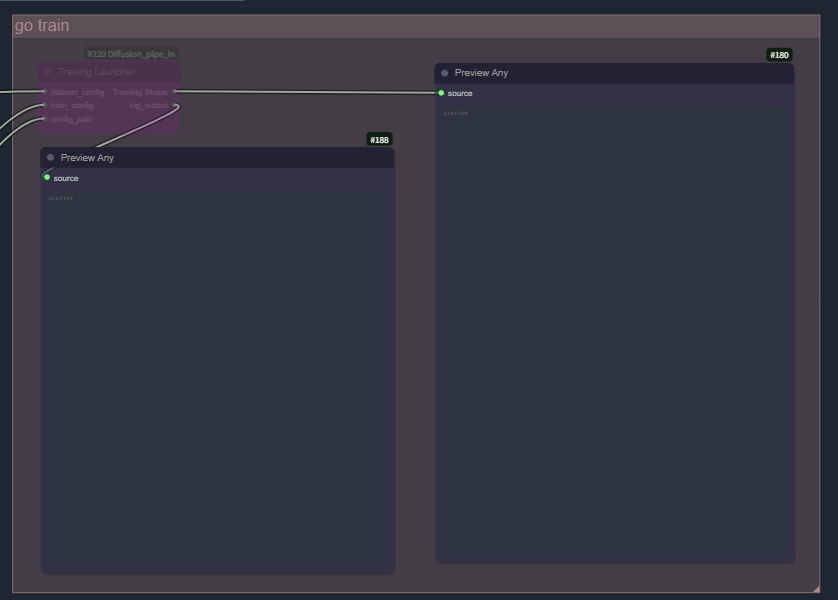
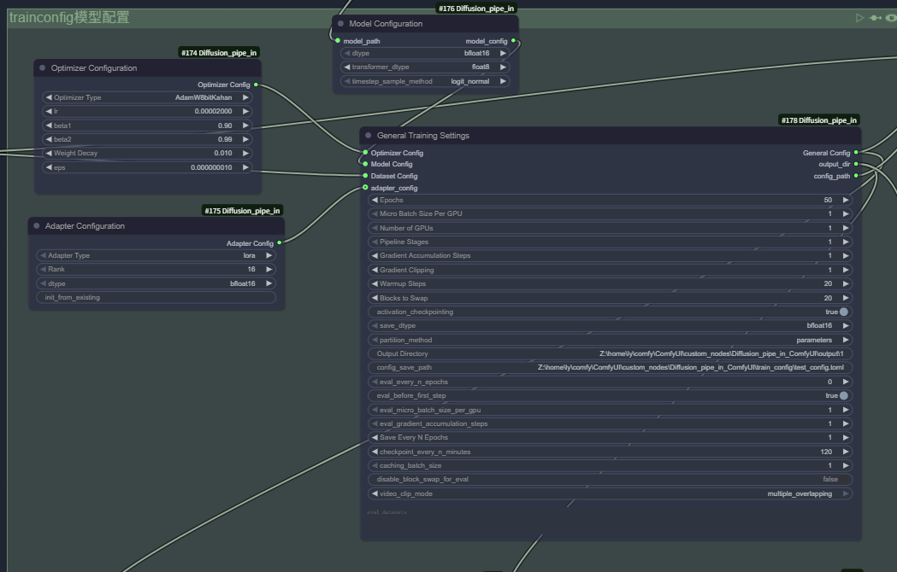
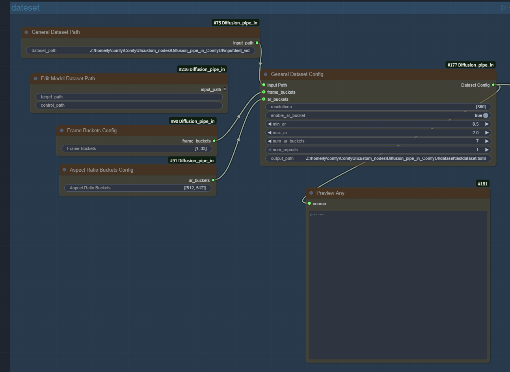
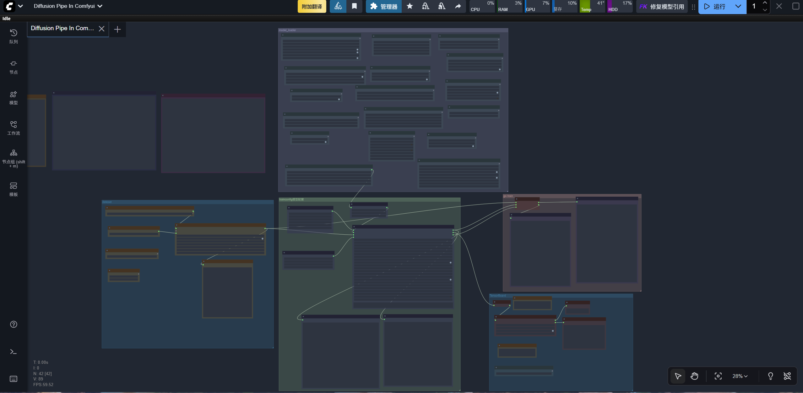
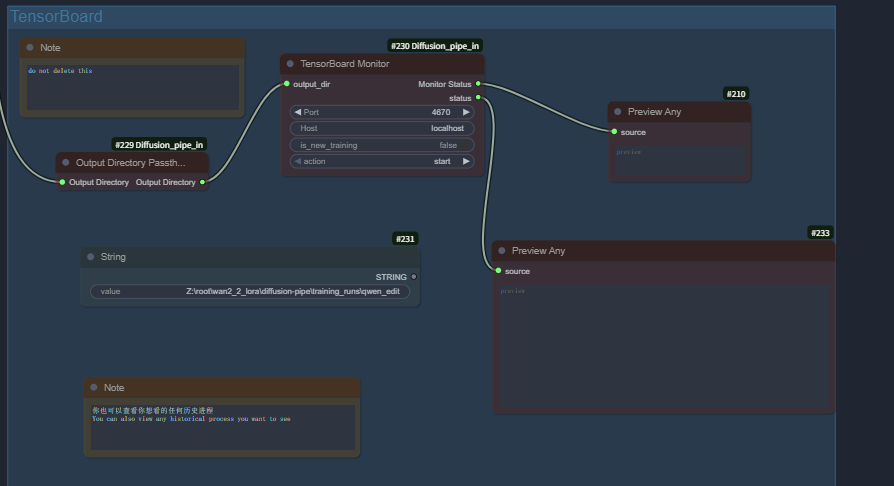

# Diffusion-Pipe In ComfyUI Custom Nodes

 *查看[中文](./READMEChinese.md)*

## Project Overview

Diffusion-Pipe In ComfyUI custom nodes is a powerful extension plugin that provides complete Diffusion model training and fine-tuning functionality for ComfyUI. This project allows users to configure and launch training for various advanced AI models through ComfyUI's graphical interface, supporting both LoRA and full fine-tuning, covering the most popular image generation and video generation models.

***Video Demo: https://www.bilibili.com/video/BV1DAnKzTEup/?share_source=copy_web&vd_source=5a2c3d8b60d05e98a2e7f4f58f77eba5***

***[📋 View Supported Models](./docs/supported_models.md)***

### I don't have much time to test each model individually, please submit an issue if you find any problems

# Quick Start

## Installation Guide

### Installation 
Make sure you have ComfyUI on Linux or WSL2 system, refer to https://docs.comfy.org/installation/manual_install

ps: ComfyUI on WSL2 works so well that I even want to delete my ComfyUI on Windows

```bash
conda create -n comfyui_DP python=3.12
```
```bash
conda activate comfyui_DP
```

```bash
cd ~/comfy/ComfyUI/custom_nodes/
```

```bash
git clone --recurse-submodules https://github.com/TianDongL/Diffusion_pipe_in_ComfyUI.git
```

* If you haven't installed submodules, follow these steps 

* If you don't do this step, training will not work

```bash
git submodule init
git submodule update
```

# Install Dependencies
```bash
conda activate comfyui_DP
```
Here are the necessary dependencies for deepspeed, first install PyTorch. It is not listed in the requirements document because some GPUs sometimes require different versions of PyTorch or CUDA, and you may have to find a combination that suits your hardware.
```bash
pip install torch==2.7.1 torchvision==0.22.1 torchaudio==2.7.1 --index-url https://download.pytorch.org/whl/cu128
```
```bash
cd ~/comfy/ComfyUI/custom_nodes/Diffusion_pipe_in_ComfyUI
```
```bash
pip install -r requirements.txt
```

## 🚀 One-Click Import Workflow

To get you started quickly, we provide pre-configured ComfyUI workflow files:

***[📋 Click to Import Complete Workflow](./DiffusionPipeInComfyUI.json)***

Drag this file into the ComfyUI interface to import the complete training workflow, including all necessary node configurations.

## Please read the prompts in the workflow carefully, this can help you build your dataset

# 📷 Workflow Interface Preview

<div align="center">


Models can be stored in the ComfyUI model directory


*Disable Train node when debugging*


Models can be stored in the ComfyUI model directory


Recommend storing datasets in paths like Z:\ComfyUI\custom_nodes\Diffusion_pipe_in_ComfyUI\input\test_vid
Recommend dataset configuration paths like Z:\ComfyUI\custom_nodes\Diffusion_pipe_in_ComfyUI\dataset\testdataset.toml




*kill port will stop all monitoring processes on the current port*

</div>

### Core Features

- 🎯 **Visual Training Configuration**: Graphically configure training parameters through ComfyUI nodes
- 🚀 **Multi-Model Support**: Support for 20+ latest Diffusion models
- 💾 **Flexible Training Methods**: Support for LoRA training and full fine-tuning
- ⚡ **High-Performance Training**: DeepSpeed-based distributed training support
- 📊 **Real-time Monitoring**: Integrated TensorBoard training process monitoring
- 🔧 **WSL2 Optimization**: Specially optimized Windows WSL2 environment support
- 🎥 **Video Training**: Support for video generation model training
- 🖼️ **Image Editing**: Support for image editing model training

## System Requirements

### Hardware Requirements
- * I don't know, you can try :-P	

### Software Requirements
- **Operating System**: Linux / Windows 10/11 + WSL2
- **ComfyUI**: Latest version

## Supported Models

This plugin supports over 20 latest Diffusion models, including:

| Model          | LoRA | Full Fine Tune | fp8/quantization |
|----------------|------|----------------|------------------|
|SDXL            |✅    |✅              |❌                |
|Flux            |✅    |✅              |✅                |
|LTX-Video       |✅    |❌              |❌                |
|HunyuanVideo    |✅    |❌              |✅                |
|Cosmos          |✅    |❌              |❌                |
|Lumina Image 2.0|✅    |✅              |❌                |
|Wan2.1          |✅    |✅              |✅                |
|Chroma          |✅    |✅              |✅                |
|HiDream         |✅    |❌              |✅                |
|SD3             |✅    |❌              |✅                |
|Cosmos-Predict2 |✅    |✅              |✅                |
|OmniGen2        |✅    |❌              |❌                |
|Flux Kontext    |✅    |✅              |✅                |
|Wan2.2          |✅    |✅              |✅                |
|Qwen-Image      |✅    |✅              |✅                |
|Qwen-Image-Edit |✅    |✅              |✅                |
|HunyuanImage-2.1|✅    |✅              |✅                |

## Node System Details

### 🗂️ Dataset Configuration Nodes

#### GeneralDatasetConfig (General Dataset Configuration)
Configure core parameters for training datasets:
- **Input Path**: Dataset directory path
- **Resolution Settings**: Training resolution configuration `[512]` or `[1280, 720]`
- **Aspect Ratio Bucketing**: Automatically handle images of different ratios
- **Dataset Repetition**: Control data usage frequency
- **Cache Settings**: Optimize data loading performance

#### GeneralDatasetPathNode (General Dataset Node)
Handle standard image-text pair datasets:
```
dataset/
├── image1.jpg
├── image1.txt
├── image2.png
└── image2.txt
```

#### EditModelDatasetPathNode (Edit Model Dataset)
Handle image editing datasets:
```
dataset/
├── source_images/
└── target_images/
```
❗source_images & target_images must have the same name


#### FrameBucketsNode (Frame Bucket Configuration)
Frame count configuration for video training:
- Support multiple frame length training
- Automatic batch organization

#### ArBucketsNode (Aspect Ratio Bucket Configuration)
Custom aspect ratio bucketing strategy:
- Precise control of bucket count
- Optimize VRAM usage

### 🤖 Model Configuration Nodes

- **SDXLModelNode**: SDXL model configuration
- **FluxModelNode**: Flux model configuration
- **SD3ModelNode**: SD3 model configuration
- **QwenImageModelNode**: Qwen image model
- **HiDreamModelNode**: HiDream model configuration
- **ChromaModelNode**: Chroma model configuration
- **Lumina2ModelNode**: Lumina2 model configuration
- **LTXVideoModelNode**: LTX-Video configuration
- **HunyuanVideoModelNode**: Hunyuan video configuration
- **Wan21ModelNode**: Wan2.1 configuration
- **Wan22ModelNode**: Wan2.2 configuration
- **FluxKontextModelNode**: Flux Kontext configuration
- **QwenImageEditModelNode**: Qwen image edit configuration
- **HunyuanImage-2.1Node**: Hunyuan image model configuration

### ⚙️ Training Configuration Nodes

#### GeneralConfig (General Training Settings)
Core training parameter configuration:
- **Training Epochs**: Control training duration
- **Batch Size**: GPU memory optimization
- **Learning Rate Scheduling**: Warmup and decay strategies
- **Gradient Configuration**: Accumulation and clipping settings
- **Optimizer Settings**: AdamW, AdamW8bit, etc.
- **Memory Optimization**: Block swapping, activation checkpointing

#### ModelConfig (Model Configuration)
Model-specific configuration:
- **Data Types**: bfloat16, float16, float8
- **LoRA Settings**: rank, alpha, dropout
- **Quantization Options**: FP8, 4bit quantization

#### AdapterConfigNode (Adapter Configuration)
Detailed LoRA adapter configuration:
- **Target Modules**: Select model parts to train
- **LoRA Parameters**: rank, alpha, target dimensions
- **Training Strategy**: Partial freezing, layered learning rates

#### OptimizerConfigNode (Optimizer Configuration)
Detailed optimizer settings:
- **Optimizer Type**: AdamW, Lion, Adafactor
- **Learning Rate**: Base learning rate and scheduling
- **Regularization**: Weight decay, gradient clipping

### 🚀 Training Control Nodes

#### Train (Training Launcher)
Launch and control training process:
- **Configuration Merging**: Automatically merge dataset and training configurations
- **Process Management**: Start, monitor training
- **Error Handling**: Exception capture and recovery
- **Log Output**: Real-time training status

#### TensorBoardMonitor (TensorBoard Monitor)
Real-time training monitoring:
- **Loss Curves**: Training and validation loss
- **Learning Rate Tracking**: Learning rate change curves
- **GPU Utilization**: Hardware usage
- **Sample Preview**: Generated sample quality monitoring

#### OutputDirPassthrough (Output Directory Passthrough)
Utility node to simplify path passing.

## License

This project is open source under the Apache License 2.0.

## Contributing Guide

Issues and Pull Requests are welcome!

1. Fork the project
2. Create a feature branch
3. Submit changes
4. Create a Pull Request

## Acknowledgments

Thanks to the following projects and teams:
- ComfyUI team
- Original author of Diffusion_Piped @tdrussell
- Hugging Face Diffusers
- DeepSpeed team
- Original authors of various models 