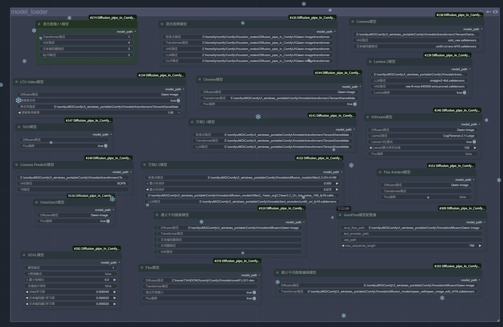
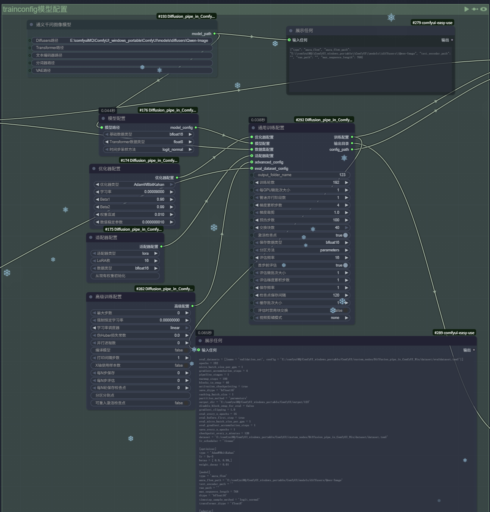
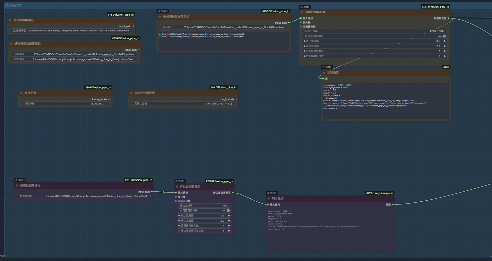

# Diffusion pipe in ComfyUI For Windows Custom Node


<div align="center">
  
  [](https://huggingface.co/TianDongL/DiffusionPipeInComfyUI_Win)

  [](https://github.com/TianDongL/Diffusion_pipe_in_ComfyUI.git)

  [](https://github.com/tdrussell/diffusion-pipe.git)


</div>


# 点击查看 [中文文档](./READMEChinese.md)


## Project Overview

Diffusion-Pipe In ComfyUI Custom Node is a powerful extension plugin that provides complete Diffusion model training and fine-tuning capabilities for ComfyUI. This project allows users to configure and launch training for various advanced AI models within ComfyUI's graphical interface, supporting both LoRA and full fine-tuning, covering the most popular image generation and video generation models available today.You can train Qwen lora with 16g Vram

***Video Demo: https://www.bilibili.com/video/BV1DAnKzTEup/?share_source=copy_web&vd_source=5a2c3d8b60d05e98a2e7f4f58f77eba5***

***[📋 View Supported Models](./docs/supported_models.md)***

## update

* 20251026:support eval 

* 20251030:Supports training Aura models

* 20251103:support MultiImage Edit (qwen2509)

* 20251105:support mask trainning,Fix off-by-one error in plots when using examples as x-axis,Allow using captions.json without tar files,add reset_optimizer flag,--reset_optimizer_params flag（Reset optimizer parameters, which allows resetting the optimizer during resuming training）,Fix datasets issue,Cast to float16 in dataset caching to cut size on disk in half

# Quick Start
## You can use my pre configured portable environment pack
```bash
https://huggingface.co/TianDongL/DiffusionPipeInComfyUI_Win
```

***You still need to download Microsoft MPI to prepare the deepspeed environment for Windows: https://www.microsoft.com/en-us/download/details.aspx?id=105289***

*Download and restart the computer*

```bash
git clone --recurse-submodules https://github.com/TianDongL/Diffusion_pipe_in_ComfyUI_Win.git
```
* If you haven't installed the submodules, follow these steps
* If you don't complete this step, training will not work

```bash
git submodule init
```
```bash
git submodule update
```

## Conda Environment Installation Guide

```bash
conda create -n comfyui_DP python=3.11
```
```bash
conda activate comfyui_DP
```
```bash
pip install torch==2.7.1 torchvision==0.22.1 torchaudio==2.7.1 --index-url https://download.pytorch.org/whl/cu128
```

* You need to install pre-compiled wheels for Windows. You can find the compiled wheels in my Releases. This project requires deepspeed==0.17.0 https://github.com/TianDongL/Diffusion_pipe_in_ComfyUI_Win/releases

```bash
pip install E:/ComfyUI/deepspeed-0.17.0+720787e7-cp311-cp311-win_amd64.whl
```

* And flash-attn==2.8.1

```bash
pip install E:/ComfyUI/flash_attn-2.8.1-cp311-cp311-win_amd64.whl
```

* Also bitsandbytes compiled for Windows

```bash
pip install bitsandbytes --prefer-binary --extra-index-url=https://jllllll.github.io/bitsandbytes-wheels/windows/index.html
```
```bash
cd /ComfyUI/custom_nodes/Diffusion_pipe_in_ComfyUI_Win.git
```
```bash
pip install -r requirements.txt
```

## Portable Environment Installation Guide

* You are responsible for backing up your portable environment
* My wheels are all compiled under Torch 2.7.1+cu128-cp311

*Skip this step if you already meet the requirements*

```bash
E:/ComfyUI_windows_portable/python_embeded/python.exe -m pip install torch==2.7.1 torchvision==0.22.1 torchaudio==2.7.1 --index-url https://download.pytorch.org/whl/cu128
```

*Install necessary dependencies directly*

*You need to install pre-compiled wheels for Windows. You can find the compiled wheels in my Releases. This project requires deepspeed==0.17.0 https://github.com/TianDongL/Diffusion_pipe_in_ComfyUI_Win/releases*

```bash
E:/ComfyUI_windows_portable/python_embeded/python.exe -m pip install E:/ComfyUI_windows_portable/python_embeded_DP/deepspeed-0.17.0+720787e7-cp311-cp311-win_amd64.whl
```

*And flash-attn==2.8.1*

```bash
E:/ComfyUI_windows_portable/python_embeded/python.exe -m pip install E:/ComfyUI_windows_portable/python_embeded_DP/flash_attn-2.8.1-cp311-cp311-win_amd64.whl
```

*And bitsandbytes compiled for Windows*

```bash
E:/ComfyUI_windows_portable/python_embeded/python.exe -m pip install bitsandbytes --prefer-binary --extra-index-url=https://jllllll.github.io/bitsandbytes-wheels/windows/index.html
```

```bash
cd /ComfyUI/custom_nodes/Diffusion_pipe_in_ComfyUI_Win.git
```
```bash
E:/ComfyUI_windows_portable/python_embeded/python.exe -m pip install -r requirements.txt
```

## 🚀 One-Click Workflow Import

To get you started quickly, I've provided a pre-configured ComfyUI workflow file:

***[📋 Click to Import Complete Workflow](./example_workflows/DiffusionPipeInComfyUIWin.json)***

Simply drag this file into the ComfyUI interface to import the complete training workflow with all necessary node configurations.

## Please read the prompts in the workflow carefully, as they can help you build your dataset


# 📷 Workflow Interface Preview

<div align="center">


Models can be stored in the ComfyUI model directory


*Disable the Train node when debugging*


Model Configuration


Dataset Configuration


Workflow Overview


*kill port will stop all monitoring processes on the current port*

</div>


### Core Features

- 🎯 **Visual Training Configuration**: Graphically configure training parameters through ComfyUI nodes
- 🚀 **Multi-Model Support**: Support for 20+ latest Diffusion models
- 💾 **Flexible Training Methods**: Support for both LoRA training and full fine-tuning
- ⚡ **High-Performance Training**: Distributed training support based on DeepSpeed
- 📊 **Real-Time Monitoring**: Integrated TensorBoard for monitoring training progress
- 🎥 **Video Training**: Support for training video generation models
- 🖼️ **Image Editing**: Support for training image editing models

## System Requirements

### Hardware Requirements
- On Windows, it seems 16GB VRAM can train Qwen, which is quite Confusing

### Software Requirements
- **Operating System**: Windows 10/11 
- **ComfyUI**: Latest version


## Supported Models

This plugin supports over 20 of the latest Diffusion models, including:

| Model          | LoRA | Full Fine Tune | fp8/quantization |
|----------------|------|----------------|------------------|
|SDXL            |✅    |✅              |❌                |
|Flux            |✅    |✅              |✅                |
|LTX-Video       |✅    |❌              |❌                |
|HunyuanVideo    |✅    |❌              |✅                |
|Cosmos          |✅    |❌              |❌                |
|Lumina Image 2.0|✅    |✅              |❌                |
|Wan2.1          |✅    |✅              |✅                |
|Chroma          |✅    |✅              |✅                |
|HiDream         |✅    |❌              |✅                |
|SD3             |✅    |❌              |✅                |
|Cosmos-Predict2 |✅    |✅              |✅                |
|OmniGen2        |✅    |❌              |❌                |
|Flux Kontext    |✅    |✅              |✅                |
|Wan2.2          |✅    |✅              |✅                |
|Qwen-Image      |✅    |✅              |✅                |
|Qwen-Image-Edit |✅    |✅              |✅                |
|HunyuanImage-2.1|✅    |✅              |✅                |
|AuraFlow        |✅    |❌              |✅                |


## License

This project is open-sourced under the Apache License 2.0.

## Contributing

Issues and Pull Requests are welcome!

1. Fork the project
2. Create a feature branch
3. Commit your changes
4. Submit a Pull Request

## Acknowledgments

Thanks to the following projects and teams:
- ComfyUI team
- [@tdrussell](https://github.com/tdrussell/diffusion-pipe.git), the original author of Diffusion_Pipe
- Hugging Face Diffusers
- DeepSpeed team
- Original authors of all models


