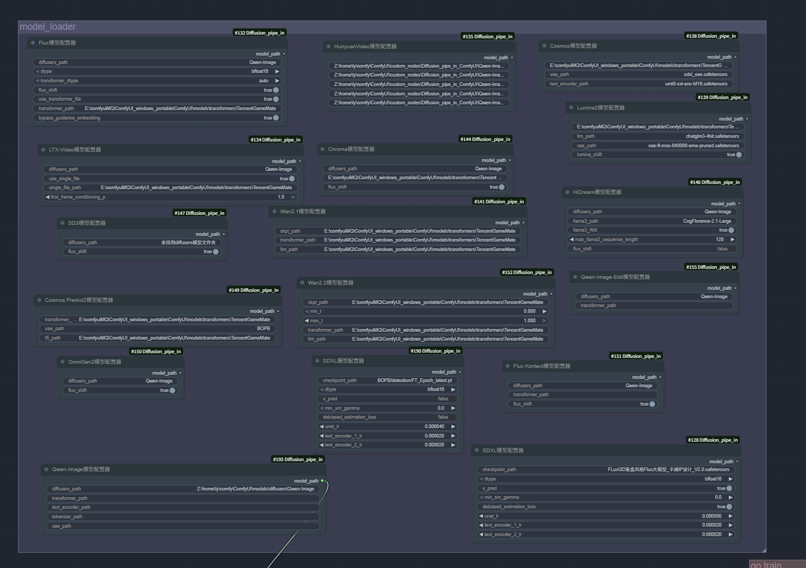
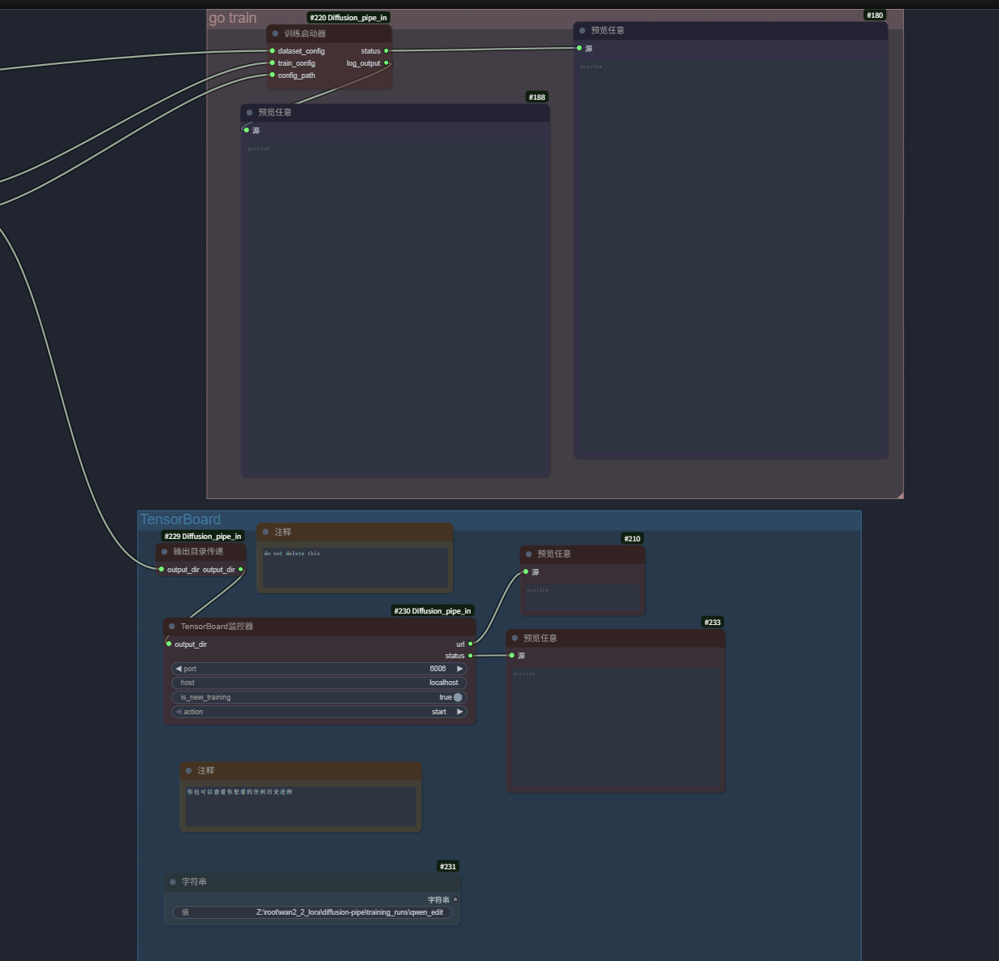
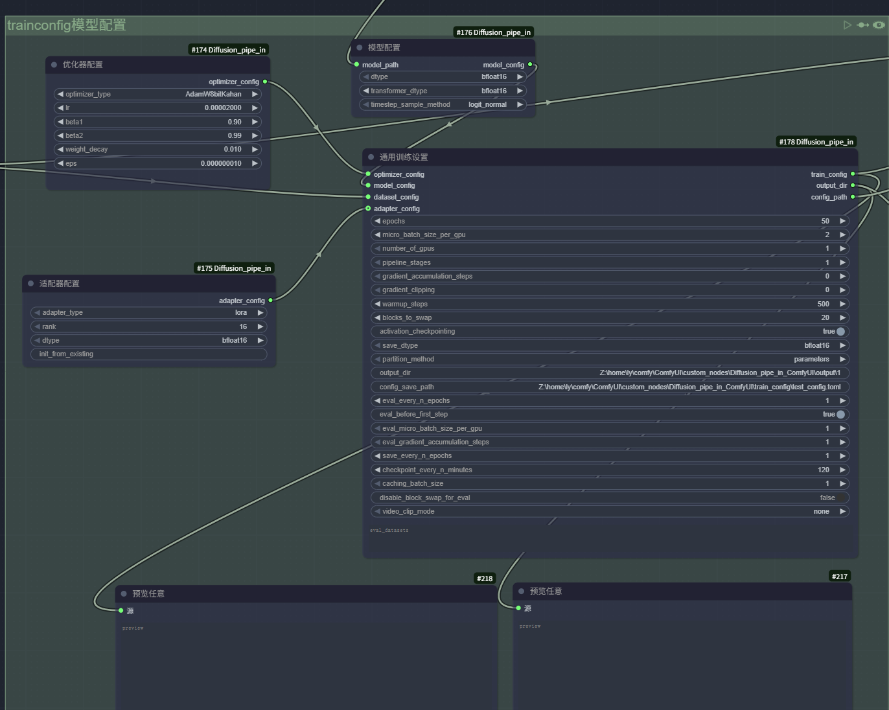
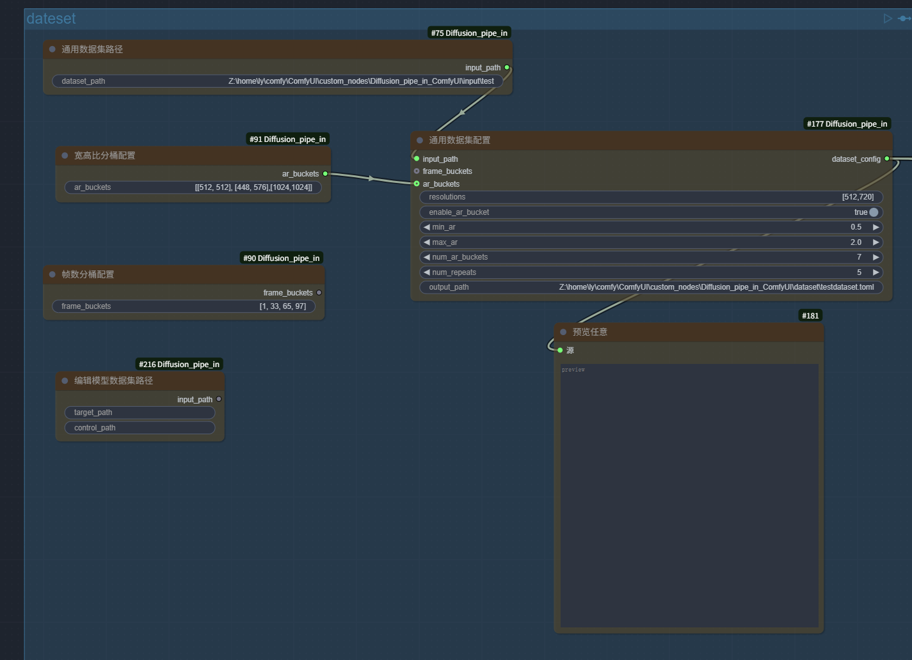
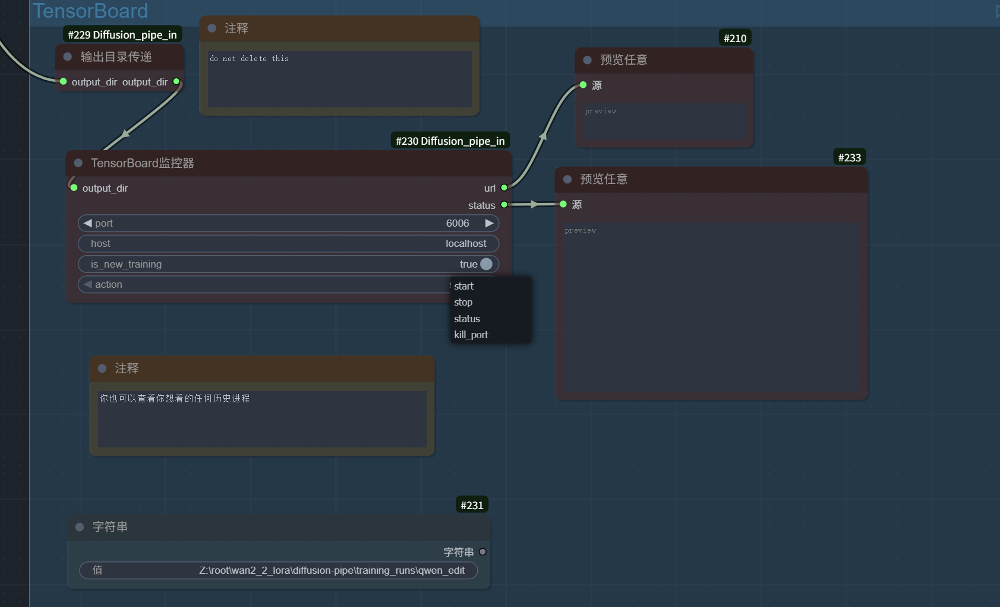

 # Diffusion_pipe_in_ComfyUI_Win 自定义节点

# click to see [English](./README.md)

## 项目简介

Diffusion-Pipe In ComfyUI 自定义节点是一个强大的扩展插件，为 ComfyUI 提供了完整的 Diffusion 模型训练和微调功能。这个项目允许用户在 ComfyUI 的图形界面中配置和启动各种先进 AI 模型的训练，支持 LoRA 和全量微调，涵盖了当前最热门的图像生成和视频生成模型。windows上16g可训练Qwen。


***视频演示：https://www.bilibili.com/video/BV1DAnKzTEup/?share_source=copy_web&vd_source=5a2c3d8b60d05e98a2e7f4f58f77eba5***

***[📋 查看支持的模型](./docs/supported_models.md)***


# 快速开始
## 你可以使用我的配置好的便携式环境包：
```bash
https://huggingface.co/TianDongL/DiffusionPipeInComfyUI_Win
```

***你仍然需要下载Microsoft MPI来为windows准备deepspeed的环境：https://www.microsoft.com/en-us/download/details.aspx?id=105289***

*下载后重新启动电脑*

```bash
git clone --recurse-submodules https://github.com/TianDongL/Diffusion_pipe_in_ComfyUI_Win.git
```
* 如果你没有安装子模块，进行以下步骤 
* 如果你不进行此步骤，训练将无法进行

```bash
git submodule init
```
```bash
git submodule update
```

## conda环境安装指南

```bash
conda create -n comfyui_DP python=3.11
```

```bash
conda activate comfyui_DP
```

```bash
pip install torch==2.7.1 torchvision==0.22.1 torchaudio==2.7.1 --index-url https://download.pytorch.org/whl/cu128
```

*你需要安装为win预编译的轮子，你可以在我的Releases中找到为其编译的轮子，此项目需要deepspeed==0.17.0 https://github.com/TianDongL/Diffusion_pipe_in_ComfyUI_Win/releases*

```bash
pip install E:/ComfyUI/deepspeed-0.17.0+720787e7-cp311-cp311-win_amd64.whl
```

*和flash-attn==2.8.1*

```bash
pip install E:/ComfyUI/deepspeed-0.17.0+720787e7-cp311-cp311-win_amd64.whl
```

*还有为win编译的bitsandbytes*

```bash
pip install bitsandbytes --prefer-binary --extra-index-url=https://jllllll.github.io/bitsandbytes-wheels/windows/index.html
```

```bash
cd /ComfyUI/custom_nodes/Diffusion_pipe_in_ComfyUI_Win.git
```

```bash
pip install -r requirements.txt
```

## 便携环境安装指南

* 你有义务备份你的便携式环境

* 我的轮子都是在Torch 2.7.1+cu128-cp311下编译的

*如果你已经满足了对应的环境，跳过这步*

```bash
E:/ComfyUI_windows_portable/python_embeded/python.exe -m pip install torch==2.7.1 torchvision==0.22.1 torchaudio==2.7.1 --index-url https://download.pytorch.org/whl/cu128
```

*直接安装必要依赖*

*你需要安装为win预编译的轮子，你可以在我的Releases中找到为其编译的轮子，此项目需要deepspeed==0.17.0 https://github.com/TianDongL/Diffusion_pipe_in_ComfyUI_Win/releases*

```bash
E:/ComfyUI_windows_portable/python_embeded/python.exe -m pip install E:/ComfyUI_windows_portable/python_embeded_DP/deepspeed-0.17.0+720787e7-cp311-cp311-win_amd64.whl
```

*和flash-attn==2.8.1*

```bash
E:/ComfyUI_windows_portable/python_embeded/python.exe -m pip install E:/ComfyUI_windows_portable/python_embeded_DP/flash_attn-2.8.1-cp311-cp311-win_amd64.whl
```

*以及为win编译的bitsandbytes*

```bash
E:/ComfyUI_windows_portable/python_embeded/python.exe -m pip install bitsandbytes --prefer-binary --extra-index-url=https://jllllll.github.io/bitsandbytes-wheels/windows/index.html
```

```bash
cd /ComfyUI/custom_nodes/Diffusion_pipe_in_ComfyUI_Win.git
```

```bash
E:/ComfyUI_windows_portable/python_embeded/python.exe -m pip install -r requirements.txt
```

## 🚀 一键导入工作流

为了让你快速开始，我提供了预配置的 ComfyUI 工作流文件：

***[📋 点击导入完整工作流](./examworkflow_DP.json)***

将此文件拖拽到 ComfyUI 界面中即可导入完整的训练工作流，包含所有必要的节点配置。

## 请仔细阅读工作流中的提示，这可以帮助你进行数据集的构建


# 📷 工作流界面预览

<div align="center">


模型可以存放在comfyui的模型目录下


*调试时禁用Train节点*








*kill port会停止当前端口一切监控进程*

</div>


### 核心特性

- 🎯 **可视化训练配置**: 通过 ComfyUI 节点图形化配置训练参数
- 🚀 **多模型支持**: 支持 20+ 种最新的 Diffusion 模型
- 💾 **灵活训练方式**: 支持 LoRA 训练和全量微调
- ⚡ **高性能训练**: 基于 DeepSpeed 的分布式训练支持
- 📊 **实时监控**: 集成 TensorBoard 监控训练过程
- 🎥 **视频训练**: 支持视频生成模型的训练
- 🖼️ **图像编辑**: 支持图像编辑模型的训练

## 系统要求

### 硬件要求
- win上似乎16gVRAM可以训练Qwen，这让我很困惑

### 软件要求
- **操作系统**: Windows 10/11 
- **ComfyUI**: 最新版本


## 支持的模型

本插件支持超过 20 种最新的 Diffusion 模型，包括：

| Model          | LoRA | Full Fine Tune | fp8/quantization |
|----------------|------|----------------|------------------|
|SDXL            |✅    |✅              |❌                |
|Flux            |✅    |✅              |✅                |
|LTX-Video       |✅    |❌              |❌                |
|HunyuanVideo    |✅    |❌              |✅                |
|Cosmos          |✅    |❌              |❌                |
|Lumina Image 2.0|✅    |✅              |❌                |
|Wan2.1          |✅    |✅              |✅                |
|Chroma          |✅    |✅              |✅                |
|HiDream         |✅    |❌              |✅                |
|SD3             |✅    |❌              |✅                |
|Cosmos-Predict2 |✅    |✅              |✅                |
|OmniGen2        |✅    |❌              |❌                |
|Flux Kontext    |✅    |✅              |✅                |
|Wan2.2          |✅    |✅              |✅                |
|Qwen-Image      |✅    |✅              |✅                |
|Qwen-Image-Edit |✅    |✅              |✅                |
|HunyuanImage-2.1|✅    |✅              |✅                |


## 节点系统详解

### 🗂️ 数据集配置节点

#### GeneralDatasetConfig（通用数据集配置）
配置训练数据集的核心参数：
- **输入路径**: 数据集目录路径
- **分辨率设置**: 训练分辨率配置 `[512]` 或 `[1280, 720]`
- **宽高比分桶**: 自动处理不同比例的图像
- **数据集重复**: 控制数据使用频率
- **缓存设置**: 优化数据加载性能

#### GeneralDatasetPathNode（通用数据集节点）
处理标准图像-文本对数据集：
```
dataset/
├── image1.jpg
├── image1.txt
├── image2.png
└── image2.txt
```

#### EditModelDatasetPathNode（编辑模型数据集）
处理图像编辑数据集：
```
dataset/
├── source_images/
└── target_images/
```
source_images 和 target_images必须有相同的文件名

#### FrameBucketsNode（帧数分桶配置）
视频训练的帧数配置：
- 支持多种帧长度训练
- 自动批次组织

#### ArBucketsNode（宽高比分桶配置）
自定义宽高比分桶策略：
- 精确控制分桶数量
- 优化 VRAM 使用

### 🤖 模型配置节点

- **SDXLModelNode**: SDXL 模型配置
- **FluxModelNode**: Flux 模型配置
- **SD3ModelNode**: SD3 模型配置
- **QwenImageModelNode**: 通义千问图像模型
- **HiDreamModelNode**: HiDream 模型配置
- **ChromaModelNode**: Chroma 模型配置
- **Lumina2ModelNode**: Lumina2 模型配置
- **LTXVideoModelNode**: LTX-Video 配置
- **HunyuanVideoModelNode**: 混元视频配置
- **Wan21ModelNode**: Wan2.1 配置
- **Wan22ModelNode**: Wan2.2 配置
- **FluxKontextModelNode**: Flux Kontext 配置
- **QwenImageEditModelNode**: 通义千问编辑配置
- **HunyuanImage-2.1Node**:混元图像模型配置

### ⚙️ 训练配置节点

#### GeneralConfig（通用训练设置）
核心训练参数配置：
- **训练轮数**: 控制训练持续时间
- **批次大小**: GPU 内存优化
- **学习率调度**: 预热和衰减策略
- **梯度配置**: 累积和裁剪设置
- **优化器设置**: AdamW、AdamW8bit 等
- **内存优化**: 块交换、激活检查点

#### ModelConfig（模型配置）
模型特定配置：
- **数据类型**: bfloat16、float16、float8
- **LoRA 设置**: rank、alpha、dropout
- **量化选项**: FP8、4bit 量化

#### AdapterConfigNode（适配器配置）
LoRA 适配器详细配置：
- **目标模块**: 选择训练的模型部分
- **LoRA 参数**: rank、alpha、目标维度
- **训练策略**: 部分冻结、学习率分层

#### OptimizerConfigNode（优化器配置）
优化器详细设置：
- **优化器类型**: AdamW、Lion、Adafactor
- **学习率**: 基础学习率和调度
- **正则化**: 权重衰减、梯度裁剪

### 🚀 训练控制节点

#### Train（训练启动器）
启动和控制训练过程：
- **配置合并**: 自动合并数据集和训练配置
- **进程管理**: 启动、监控训练
- **错误处理**: 异常捕获和恢复
- **日志输出**: 实时训练状态

#### TensorBoardMonitor（TensorBoard监控器）
实时训练监控：
- **损失曲线**: 训练和验证损失
- **学习率追踪**: 学习率变化曲线
- **GPU 利用率**: 硬件使用情况
- **样本预览**: 生成样本质量监控

#### OutputDirPassthrough（输出目录传递）
简化路径传递的工具节点。


## 许可证

本项目基于 Apache License 2.0 许可证开源。

## 贡献指南

欢迎提交 Issue 和 Pull Request！

1. Fork 项目
2. 创建功能分支
3. 提交更改
4. 发起 Pull Request

## 致谢

感谢以下项目和团队：
- ComfyUI 团队
- Diffusion_Piped的原作者 @tdrussell
- Hugging Face Diffusers
- DeepSpeed 团队
- 各模型原始作者


